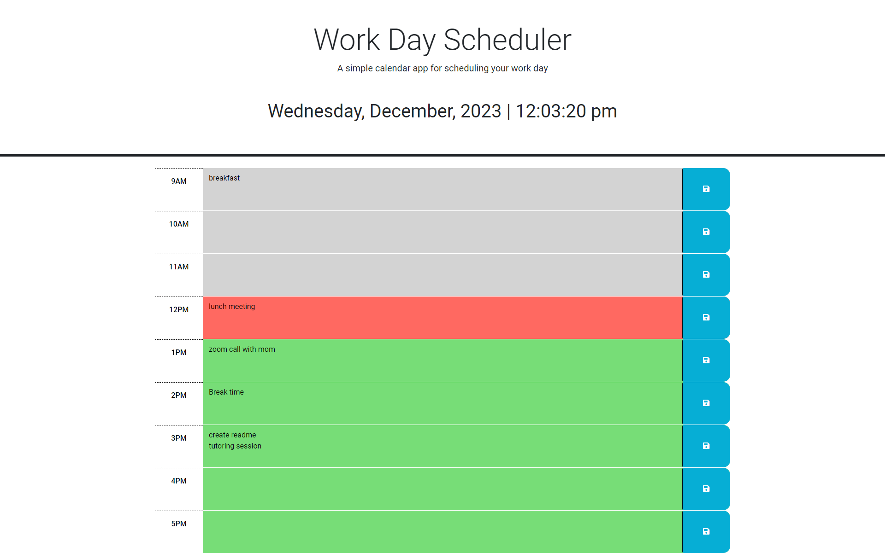

<a name="readme-top"></a>


<!-- PROJECT LOGO -->
<br />
<div align="center">
  <a href="https://github.com/sbanati/minimal_day_planner">  
    
  </a>

<h1 align="center">Minimalistic Work Day Planner</h1>

  <p align="center">
    A simple calendar application to keep track of events for the hours of a typical working day . 
    <br />
    <a href="https://github.com/sbanati/minimal_day_planner"><strong>Explore the docs »</strong></a>
    <br />
    <br />

    
  <a href="https://sbanati.github.io/passGenerator/">View Demo</a>
    
  

  </p>
</div>


<!-- TABLE OF CONTENTS -->
<details>
  <summary>Table of Contents</summary>
  <ol>
    <li>
      <a href="#about-the-project">About The Project</a>
      <ul>
        <li><a href="#built-with">Built With</a></li>
      </ul>
    </li>
    <li>
      <a href="#getting-started">Getting Started</a>
      <ul>
        <li><a href="#installation">Installation</a></li>
      </ul>
    </li>
    <li><a href="#usage">Usage</a></li>
    <li><a href="#additions">Additions</a></li>
    <li><a href="#contributing">Contributing</a></li>
    <li><a href="#acknowledgement">Acknowledgement</a></li>
    <li><a href="#contact">Contact</a></li>
  </ol>
</details>


<!-- ABOUT THE PROJECT -->
## About The Project

This project is a Javascript challenge where I was given a starter code for a simple calender application. The user in mind can be anyone,
but it is designed for someone with a typical working day schedule of 9am - 5pm. 
<br><br>
I was given an HTML/CSS/and Java file that had 9am - 11am. I was tasked with coding the GUI elements and the logic. I also needed to add some save functionality using localstorage. The starter code provided used the Day.js library to work with date and time. 
I was given freedom to use any Javascript solution to handle the functionality. The project was powered by dynamically updated HTML and CSS powered by jQuery


<p align="right">(<a href="#readme-top">back to top</a>)</p>


### Built With

* [](https://img.shields.io/badge/HTML5-E34F26?style=for-the-badge&logo=html5&logoColor=white)
* [](https://img.shields.io/badge/CSS3-1572B6?style=for-the-badge&logo=css3&logoColor=white)
* [](https://img.shields.io/badge/JavaScript-323330?style=for-the-badge&logo=javascript&logoColor=F7DF1E)
* 
* 
* 


<p align="right">(<a href="#readme-top">back to top</a>)</p>


<!-- GETTING STARTED -->
## Getting Started

 <h3>For end users</h3> 
https://sbanati.github.io/passGenerator/  <br>


### Installation
For anyone wanting to contribute <br>

1. Clone the repo
   ```sh
   git clone https://github.com/sbanati/minimal_day_planner
   ```

<p align="right">(<a href="#readme-top">back to top</a>)</p>


<!-- USAGE EXAMPLES -->
## Usage

<h3>gif of the day planner running. You can see the user testing the save functionality.</h3>


<p align="right">(<a href="#readme-top">back to top</a>)</p>


<!-- ROADMAP -->
## Additions

<h3>Possible features</h3>

* Adding functionality to go beyond the 9-5 and create entries for the future
* Changing the GUI to a broader calender , and then each box for a day can be interacted with leading to the 9-5 GUI. 


<p align="right">(<a href="#readme-top">back to top</a>)</p>


<!-- CONTRIBUTING -->
## Contributing

This part of the readme is where community involvement can happen! Normally I would have my Github setup to where anyone can fork and push or make an issue, but 
I am still learning that stuff. In the mean time this is how the section would look like. Pretty much from the Template. <br>

Contributions are what make the open source community such an amazing place to learn, inspire, and create. Any contributions you make are **greatly appreciated**.
If you have a suggestion that would make this better, please fork the repo and create a pull request. You can also simply open an issue with the tag "enhancement".


1. Fork the Project
2. Create your Feature Branch (`git checkout -b feature/NewFeature`)
3. Commit your Changes (`git commit -m 'Added some Goated new feature'`)
4. Push to the Branch (`git push origin feature/NewFeature`)
5. Open a Pull Request

<p align="right">(<a href="#readme-top">back to top</a>)</p>


<!-- ACKNOWLEDGEMENT -->
## Acknowledgement
* Practiced pair programming with Arkaw.


<p align="right">(<a href="#readme-top">back to top</a>)</p>


<!-- CONTACT -->
## Contact

Your Name - [@twitter_TherealSLVR](https://twitter.com/TherealSLVR) - smbanati@gmail.com

Project Link: https://github.com/sbanati/minimal_day_planner

<p align="right">(<a href="#readme-top">back to top</a>)</p>


<!-- MARKDOWN LINKS & IMAGES -->
<!-- https://www.markdownguide.org/basic-syntax/#reference-style-links -->
References:
* https://dev.to/envoy_/150-badges-for-github-pnk#skills (for badges)
* https://www.flaticon.com/free-icon/password_9177799 (for logo)
* https://github.com/othneildrew/Best-README-Template (best readme template, given to me by the Grader from challenge 1!😊)
* https://www.youtube.com/watch?v=cELVC0LMC5w&ab_channel=JavaGuides (used this guide to help me as I was stuck on localstorage for a little)
